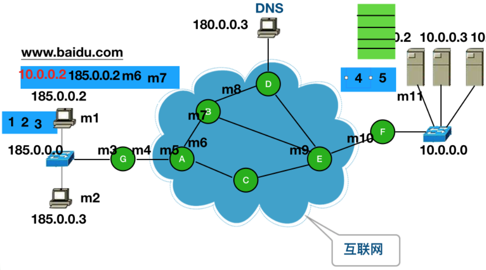
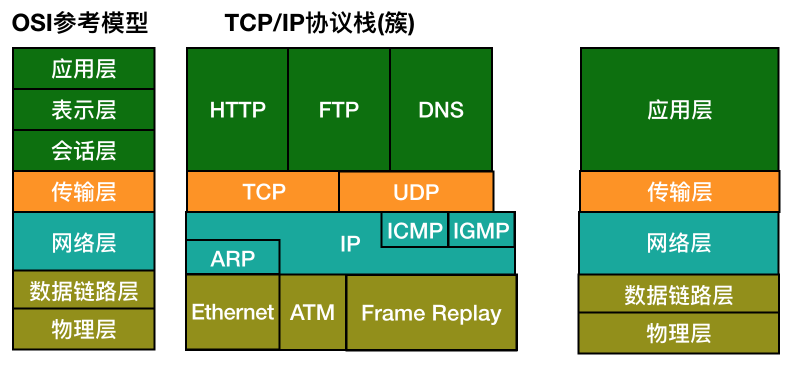
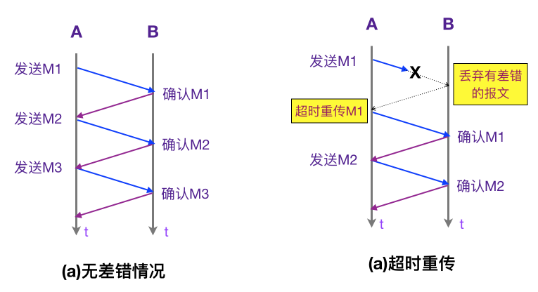
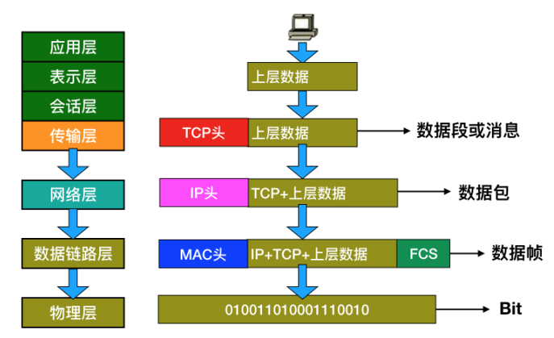
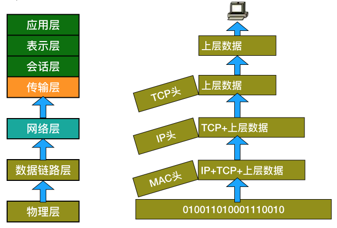
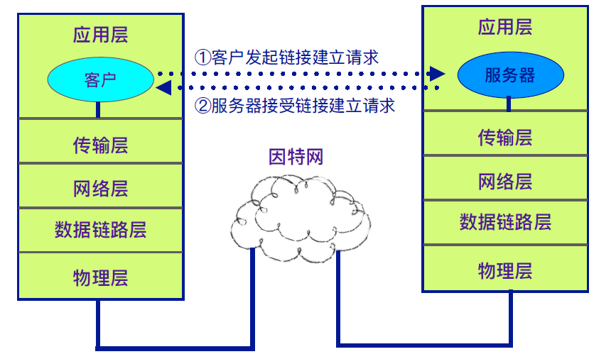
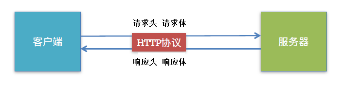
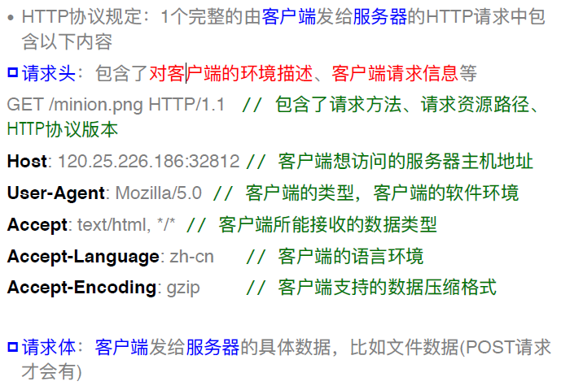
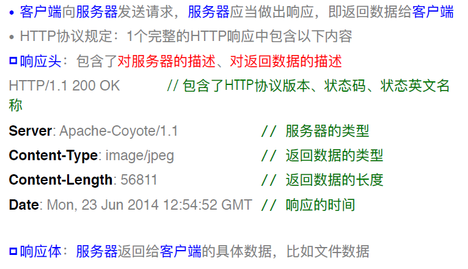

# 计算机网络基础

### 1.计算机数据通信过程

mac地址/物理地址 : 在生产的时候就确定的一个唯一的序列号

DNS的作用 : 把域名翻译成对应的ip地址

### 2.OSI参考模型

OSI模型是国际标准化组织分析计算机通信, 把计算机通信进行的规范和标准划分为7层:

**(1) 应用层:** 所有能产生网络流量的程序   (如QQ, 微信)

**(2) 表示层:** 数据传输前的压缩, 加密, 确定编码方式等操作

**(3) 会话层:** 查看木马    (交互命令netstat -n)

**(4) 传输层:** 可靠传输, 对应TCP协议 (如: 在线播放视频), 不可靠传输, 对应UDP协议 (如: 直播电视), 流量控制

**(5) 网络层:** 负责选择最佳路径, 规划IP地址

**(6) 数据链路层:** 帧的开始和结尾, 透明传输, 查错校验

**(7) 物理层:** 接口标准, 电器标准

### 3.传输层的两个协议

在TCP/IP协议栈, 传输层有两个协议: TCP和UDP

#### (1) TCP协议(传输控制协议)

**a.** 需要传输的文件分段传输

**b.** 建立会话 (如: QQ发送文件给指定联系人, 通知对方我准备给你传数据)

**c. 可靠传输** (对方同意后再传输,避免传错)

**e.** 流量控制

#### (2) UDP协议(用户数据报协议)

**a.** 一个数据包就能完成数据通信

**b.** 不需要建立会话

**c. 不可靠传输**

**d.** 不需要流量控制

### 4.数据封装

### 5. 数据解封

数据解封:  计算机在接收到数据帧后, 需要去掉为了传输而添加的附加信息, 是数据封装操作的逆向过程.

### 6.使用TCP/IP协议进行通信

### 7.URL简介

客户端是通过URL找到想要连接的服务器

#### (1)什么是URL

URL的全称是Uniform Resource Locator ( 统一资源定位符)

特点: 通过1个URL, 能找到互联网上唯一的1个资源

URL就是资源的地址,位置,互联网上的每个资源都有一个唯一的URL

基本格式 = 协议: //主机地址/路径     例如  https://my.csdn.net/hanbo6

http: 协议 -->不同的协议，代表着不同的资源查找方式、资源传输方式

my.csdn.net:  主机地址-->存放资源的主机（服务器）的IP地址（域名）

hanbo6:  路径-->资源在主机(服务器)中的具体位置

#### (2)URL中常见的协议

#### a.  HTTP

超⽂文本传输协议，访问的是远程的网络资源，格式是http://
http协议是在网络开发中最常⽤用的协议

#### b.  file

访问的是本地计算机上的资源，格式是file://（不不⽤用加主机地址）

#### c.  mailto

访问的是电子邮件地址，格式是mailto:

#### d.  FTP

访问的是共享主机的文件资源，格式是ftp://

### 8.HTTP协议简介

不不管是移动客户端还是PC端，访问远程的网络资源经常使⽤用HTTP协议

#### (1)HTTP协议的作用

HTTP的全称是Hypertext Transfer Protocol，超文本传输协议

规定客户端和服务器之间的数据传输格式

让客户端和服务器能有效地进行数据沟通

#### (2)HTTP协议的特点

a. 简单快速  (因为http协议简单,所以http服务器的程序规模小, 因而通信速度很快)

b. 灵活  (http允许传输各种各样的数据)

c. HTTP 0.9和1.0使用非持续连接(限制每次连接只处理⼀个请求，服务器对客户端的请求做出响应
后，马上断开连接，这种方式可以节省传输时间)

#### (3)HTTP协议的基本通信过程

#### (4)HTTP通信过程 - 请求

#### (4)HTTP通信过程 - 响应

#### (5)常见响应状态码

| 状态码 |       英文名称        |               中文描述               |
| :----: | :-------------------: | :----------------------------------: |
|  200   |          OK           |               请求成功               |
|  400   |      Bad Request      | 客户端请求的语法错误，服务器⽆法解析 |
|  404   |       Not Found       |  服务器无法根据客户端的请求找到资源  |
|  500   | Internal Server Error |     服务器内部错误，⽆法完成请求     |

