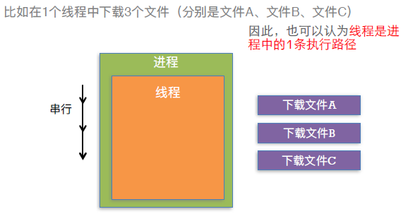

# 多线程

### 1. 进程

**定义:**  a . 是指在系统中正在运行的一个应用程序

​	   b . 每个进程之间是相互独立的, 每个进程均匀速在其专用且受保护的内存空间内

**例如:**  同时打开QQ和微信, 系统就会分别启动2个进程

### 2. 线程

**定义:** a . 一个进程要想执行任务, 必须得有线程 (每1个进程至少要有1条线程)

​	  b . 一个进程 (程序) 的所有任务都是在线程中进行

**例如:** 使用QQ聊天, 迅雷下载电影, 都需要在线程中执行

#### (1).线程的串行

**定义:**  a . 一个线程中任务的执行时串行的

​	   b . 要在1个线程中执行多个任务,只能一个一个的按顺序执行任务(也就是说: 在同一时间内, 1个线程只能执行1个任务)

**例如:** 



```python
#例如: 用python模拟线程下载文件

import time
from random import randint


def download_operation(file_name):

    # 拿到当前的时间戳(单位是秒)
    # start = time.time()
    print('开始下载%s'%file_name)

    # 程序运行到这儿就会等一会
    download_time = randint(5, 10)
    time.sleep(download_time)

    print('%s下载完成,用时：%d秒'%(file_name, download_time))


def main():
    # 时间戳的单位是秒
    start = time.time()
    download_operation('战狼2.mp4')
    download_operation('红海行动.mov')
    end = time.time()
    print('总共消耗了%.2f' % (end - start))


if __name__ == '__main__':
    main()

>>>开始下载战狼2.mp4
>>>战狼2.mp4下载完成,用时：8秒
>>>开始下载红海行动.mov
>>>红海行动.mov下载完成,用时：6秒
>>>总共消耗了14.00
```


#### (2).进程和线程的比较

(1)  线程是CPU调用(执行任务)的最小单位

(2)  进程是CPU分配资源和调度的单位

(3)  一个程序可以对应多个进程, 一个进程中可以有多个线程, 但至少要有一个线程

(4)  同一个进程内的线程共享进程的资源

**例如:** 把一个车间看作一个进程, 车间里面干活的每一个工人就是线程


### 3.多线程

**定义:**  a . 一个进程中可以开启多条线程, 每条线程可以并行 (同时) 执行不同的任务

​	   b . 多线程技术可以提高程序的执行效率

**例如:** 打开迅雷同时开启3条线程分别下载3个文件(分别是文件A, 文件B, 文件C)

**原理:**  a . 同⼀时间，CPU只能处理1条线程，只有1条线程在工作（执行）

​	   b . 多线程并发（同时）执行，其实是CPU快速地在多条线程之间调度（切换）

​	   c . 如果CPU调度线程的时间足够快，就造成了多线程并发执行的假象

**思考:** 如果线程非常非常多，会发生什么情况？

​	   a .  CPU会在N多线程之间调度

​	   b . CPU会累死

​	   c . 消耗大量的CPU资源

​	   d . 每条线程被调度执行的频次会降低（线程的执行效率降低）

```python
# 例如:  模拟多线程
"""
python3.0之前使用Thread模块去实现多线程
python3.0之后使用threading模块提供的Thread类去实现多线程
"""
import threading
from random import randint
import time

def download_operation(file_name):

    # 拿到当前的时间戳(单位是秒)
    # start = time.time()
    print('开始下载%s' % file_name)

    # 程序运行到这儿就会等一会
    download_time = randint(5, 10)
    time.sleep(download_time)

    print('%s下载完成,用时：%d秒'%(file_name, download_time))

def main():

    start = time.time()
    # 直接通过Thread类创建线程对象
    # target:告诉线程对象需要在t1线程中执行的任务，传一个函数变量(函数名)
    # args：
    t1 = threading.Thread(target=download_operation, args=("战狼2.mp4",))
    # 让线程对象去调用它的run()方法
    t1.start()

    t2 = threading.Thread(target=download_operation, args=('红海行动.mov',))
    t2.start()

    end = time.time()
    print('总共耗时%.2f秒' % (end-start))

if __name__ == '__main__':
    main()


>>>开始下载战狼2.mp4
>>>开始下载红海行动.mov
>>>总共耗时0.00秒
>>>战狼2.mp4下载完成,用时：7秒
>>>红海行动.mov下载完成,用时：8秒
```

```python
from threading import Thread
import time
from random import randint


# 1.继承Thread
class DownloadSourceThread(Thread):

    # 2.重写init方法
    def __init__(self, filename):
        # 注意：一定要调用父类的构造方法去初始化线程对象
        super().__init__()
        self._filename = filename

    # 3.重写run方法
    def run(self):
        # 需要在当前这个线程中执行的代码就写在这儿
        print('开始下载%s...'%self._filename)
        download_time = randint(5, 10)
        time.sleep(download_time)
        print('%s下载完成了,耗时%d秒' % (self._filename, download_time))


def main():
    # 使用自定义的类去创建线程对象
    t1 = DownloadSourceThread('战狼2.mp4')
    print(t1.start())

    t2 = DownloadSourceThread('红海行动.mov')
    t2.start()
    print('=======')


if __name__ == '__main__':
    main()
    
>>>开始下载战狼2.mp4...
>>>None
>>>开始下载红海行动.mov...
>>>=======
>>>战狼2.mp4下载完成了,耗时6秒
>>>红海行动.mov下载完成了,耗时10秒
```

### 4.多进程

**定义:** 同一个时间里，同一个计算机系统中允许两个或两个以上的进程处于并行状态，这是多进程 .

​	多进程带来的好处是你可以边听mp3边上网，与此同时甚至可以将下载的文档打印出来，而这些任务之间丝毫不会相互干扰。但并行需要解决的问题是通常并行的进程比CPU数量多得多，而原则上一个CPU只能分配给一个进程（引入线程后，CPU调度的基本单位是线程，进程是资源分配的最小单位），以便运行这个进程。而要让CPU同时运行多个进程，就必须使用并发技术，实现并发技术最常见的就是时间片轮转调度算法，即在操作系统的管理下，所有正在运行的进程轮流使用CPU，每个进程允许占用CPU的时间非常短(比如1毫秒)，这样用户根本感觉不出来 CPU是在轮流为多个进程服务，就好象所有的进程都在不间断地运行一样，给用户的感觉就是并行。但实际上在任何一个时间内有且仅有一个进程占有CPU。

###  5、程序和进程比较

**程序：**code+文档，静态的可执行的二进制文件，未载入内存

**进程：**程序载入内存，CPU可以调度，程序运行的载体


